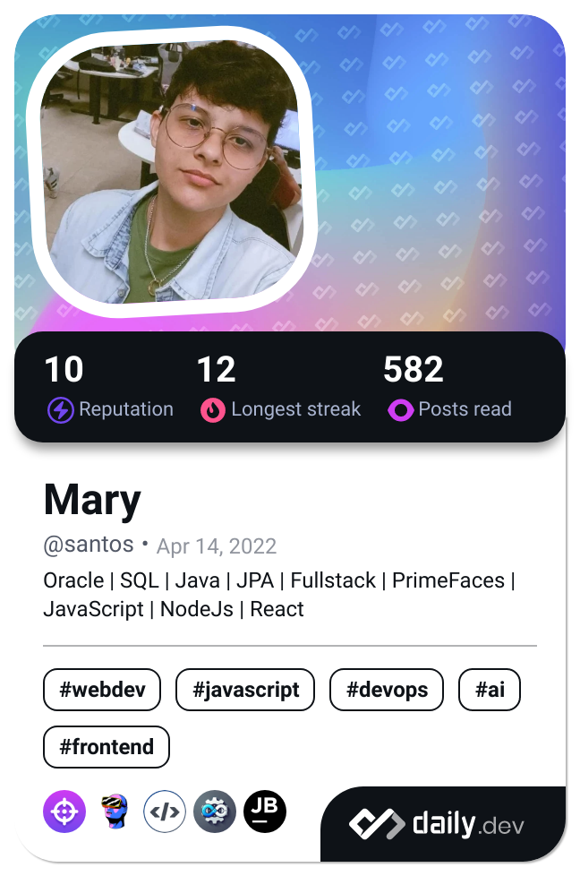

Hello, I’m Mary, a passionate 23-year-old software developer with a degree in Systems Analysis and Development. I was born in the vibrant city of Recife, in Pernambuco, and currently reside in Fortaleza, Ceará. I’m proud to have developed an innovative mobile app called GPSports, aimed at making life easier for professional and amateur athletes looking for new places to practice their favorite sports. Two years ago, I started my career as a junior software developer at Têxtil Bezerra de Menezes, a renowned factory responsible for the production of cotton and differentiated yarns. There, I handle demands using technologies such as Java, Oracle, and Flutter.

###

  
  
  
  
  
  
  
  
  
  
  
  
  
  
  
  
  

###

  
  
  
  

###

###

  
  
  

###

###
